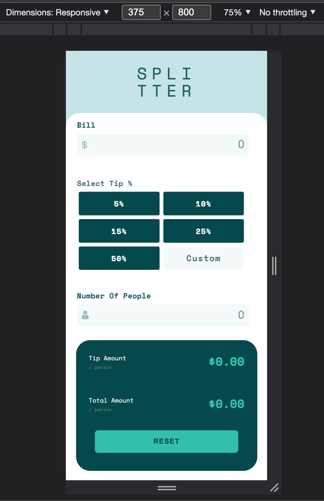
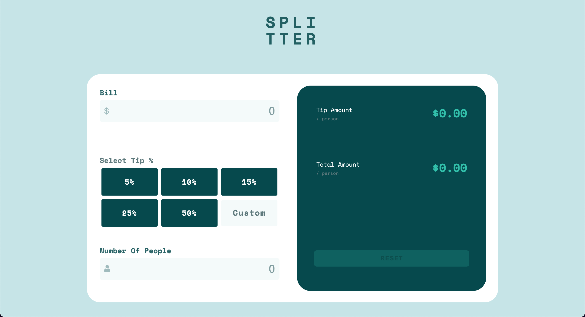

# Frontend Mentor - Tip calculator app solution

This is a solution to the [Tip calculator app challenge on Frontend Mentor](https://www.frontendmentor.io/challenges/tip-calculator-app-ugJNGbJUX). Frontend Mentor challenges help you improve your coding skills by building realistic projects.

## Table of contents

- [Overview](#overview)
  - [The challenge](#the-challenge)
  - [Screenshot](#screenshot)
  - [Demo](#links)
- [My process](#my-process)
  - [Built with](#built-with)
  - [What I learned](#what-i-learned)
  - [Continued development](#continued-development)
  - [Useful resources](#useful-resources)

## Overview

### The challenge

Users should be able to:

- View the optimal layout for the app depending on their device's screen size
- See hover states for all interactive elements on the page
- Calculate the correct tip and total cost of the bill per person

### Screenshot

### Demo

- Solution URL: [https://github.com/Kaayzeer/tip-calc](https://github.com/Kaayzeer/tip-calc)
- Live Site URL: [Add live site URL here](https://your-live-site-url.com)

## Layout

The designs were created to the following widths by order:

- Desktop: 1440px
- Mobile: 375px

### Built with

- SASS
- CSS custom properties
- Flexbox
- Desktop first
- [React](https://reactjs.org/) - JS library

### What I learned

I´ve learned about inmplementing SASS with a react application and the power
it comes with it. The dynamically strong css you can apply with SASS is very useful and I will deinitely continue my development in with theese tools.

I´ve also took the step to the open source community and hope to gain isight as well as hopefully contribute with anything to other members that might need it!.
